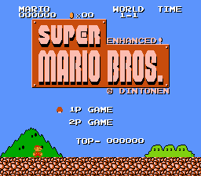
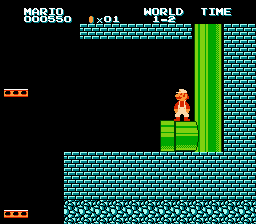
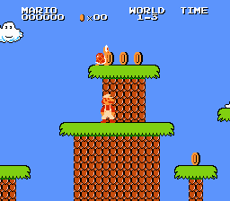
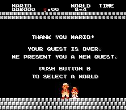

Official repository of the **Enhanced Super Mario Bros.** ROM hack.

Super Mario Bros., even with its many glitches, was where Mario was born for a lot of people in the West. But looking back at it now, it looks very basic, and it had a lot of bugs in it that were fixed in a later version that never released in the US, or were never fixed.

That's why the Enhanced Super Mario Bros. ROM hack project was born. The project aims to fix the game's many bugs, even ones that players at the time were not aware of, as well as replace the game's graphics with newer but still official ones, from Super Mario Bros.: The Lost Levels (a.k.a. SMB2 Japan).

[View the ROM hack on ROMhacking.net](https://www.romhacking.net/hacks/6953/) (note: might not be up-to-date) 






# Features
- SMB2J graphics
- European (PAL) version bug fixes and changes (except for changes made to compensate FPS difference)
- More bug fixes, e.g.:
- - Minus World bugfix + scroll unlocker fix by Mike Schiraldi, covered by [Displaced Gamers](//youtu.be/61m5MiyC17s) (read more on the [Super Mario Wiki](/mariowiki.com/Minus_World)) (you don't go to Minus World anymore)
- - Wrong warp bugfix in 4-2 and 8-4 (read more on the [Super Mario Wiki](//mariowiki.com/List_of_Super_Mario_Bros._glitches#Wrong_Warp)) (sorry speedrunners)
- - Spiny Egg behavior bugfix (read more on [The Cutting Room Floor](//tcrf.net/Super_Mario_Bros.#Unused_Spiny_Egg_Behavior)) (TASes will lose to these Spiny Eggs)
- - Mushroom jump bugfix (read more on the [Super Mario Wiki](//mariowiki.com/List_of_Super_Mario_Bros._glitches#Mushroom_Jump))
## Known but not fixed bugs
- [x] ~~Piranha Plant disappearing in the first section of 8-4 ([video of Bismuth explaining the bug](//youtu.be/U7RzoIEoSMY?t=1316))~~ Fixed in [v1.0.3](../../releases/tag/v1.0.3)
- [ ] Small Fire Mario
- [ ] Animation bug when holding A+B at the start of a level

*and more...*

# Download
You can download the latest version of the ROM hack [here](../../releases/latest/download/enhanced-smb1.zip).  
Use [Lunar IPS](https://www.romhacking.net/utilities/240/) (Windows) or the [Linux IPS Tool](https://github.com/kylon/Lipx) (Python) along with a clean, NTSC Super Mario Bros. ROM to apply the hack. Or if your emulator supports auto-applying IPS patches, just place the original ROM and the IPS file in the same folder and make sure they have the same filename.

# How to compile
NOTE: You should really use the IPS file above instead of building the ROM from scratch. If you're willing to do this, good luck...
## Step 0
Download the repo or clone it with `git`. This is self-explanatory.
## Step 1
Download CC65.
### Linux/WSL
Click [here](https://github.com/cc65/cc65/releases/latest) and download the source code or `git clone https://github.com/cc65/cc65.git`. The latter is not recommended as it is a development version.  
Now, place yourself in the root of the CC65 repository, run `make` then CTRL+C when you see binaries in the `bin` folder.  
Then run `sudo make avail`, which creates symbolic links to the binaries. This is optional, but really helpful if you don't like typing the path to the binaries. Also make sure the path to the binaries doesn't have a space, or the command will **fail**!

### Windows
Download the latest Windows snapshot [here](https://sourceforge.net/projects/cc65/files/cc65-snapshot-win32.zip). Extract the executables `ca65.exe` and `ld65.exe` from within the `bin` folder. Copy them to the root of the repo folder.

## Step 2
Open a terminal and run these commands in the root of the repo folder. Replace `ca65` and `ld65` with the path to the binaries if necessary.
```
ca65 -t nes enhanced-smb1.asm -o enhanced-smb1.o
ld65 -C nrom.cfg -o enhanced-smb1.nes enhanced-smb1.o
```
If no errors happen, a file named `enhanced-smb1.nes` will be created. You can use [Lunar IPS](https://www.romhacking.net/utilities/240/) (Windows) or the [Linux IPS Tool](https://github.com/kylon/Lipx) (Python) along with an NTSC SMB1 ROM to create an IPS file.

# Credits
Thanks to:
- [MrWint](//github.com/MrWint) and [doppelganger](//github.com/doppelganger) for providing the disassembly of Super Mario Bros.
- [X-death25](//github.com/X-death25), creator of NesExtract (which was used during development.
- [nesdoug](//github.com/nesdoug) for providing a template `nrom.cfg` file which was modified for this project.
- Other users who contributed to the project.

## Sources
[MrWint's modified SMB1 disassembly (+ PAL version)](//github.com/MrWint/smb-dis)  
[doppelganger's original SMB1 disassembly](//gist.github.com/1wErt3r/4048722)  
[NesExtract](//github.com/X-death25/Nes-Extract)  
[HxD Hex Editor](//mh-nexus.de/en/hxd/)  
[Tile Layer Pro](//www.romhacking.net/utilities/108/)  
[SMB Title Editor (English)](//www.romhacking.net/utilities/1513/)  
[nesdoug's NROM configuration file](//github.com/nesdoug/26_Full_Game/blob/master/nrom_32k_vert.cfg)


(PS: I am the 300th downloader of this ROM hack on RHDN, lol)
